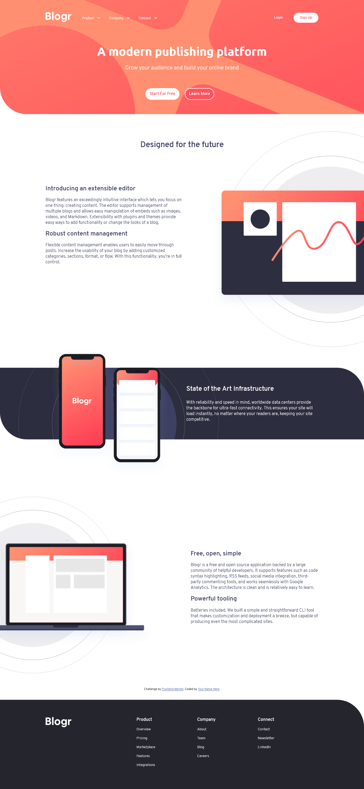
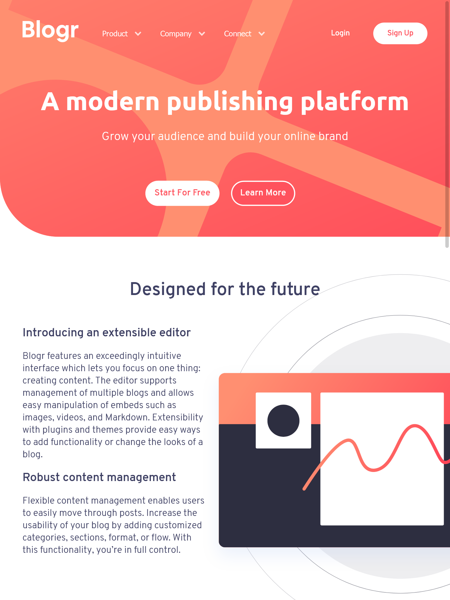

# Frontend Mentor - Blogr landing page solution

This is a solution to the [Blogr landing page challenge on Frontend Mentor](https://www.frontendmentor.io/challenges/blogr-landing-page-EX2RLAApP). Frontend Mentor challenges help you improve your coding skills by building realistic projects.

## Table of contents

- [Overview](#overview)
  - [The challenge](#the-challenge)
  - [Screenshot](#screenshot)
  - [Links](#links)
- [My process](#my-process)
  - [Built with](#built-with)
  - [What I learned](#what-i-learned)
  - [Continued development](#continued-development)
  - [Useful resources](#useful-resources)
- [Author](#author)

## Overview

### The challenge

Users should be able to:

- View the optimal layout for the site depending on their device's screen size
- See hover states for all interactive elements on the page

### Screenshot

### Links

- Solution URL: [Solution URL](https://github.com/mcclintsayshi/blogr-landing-page-main)
- Live Site URL: [Live site URL](https://mcclintsayshi.github.io/blogr-landing-page-main)

## My process

### Built with

- Semantic HTML5 markup
- CSS custom properties
- Flexbox
- CSS Grid

### What I learned

The css background property can do amazing things, At first I had no idea how I was gonna do the hero section until I started palying around with the background-\* selectors.

### Continued development

Use this section to outline areas that you want to continue focusing on in future projects. These could be concepts you're still not completely comfortable with or techniques you found useful that you want to refine and perfect.

### Useful resources

- [PX to REM Calculator](https://daniellamb.com/experiments/px-to-rem-calc/) - This helped me with converting px to rem. In the previous challenge I learned to try avoid using px since they are not responsive.
- [HTML srcset](https://www.smashingmagazine.com/2014/05/responsive-images-done-right-guide-picture-srcset/) - This helped me understand srcset even though I didnt end up using it on this project.

## Author

- Website - [Clinton Manakane](mcclintsayshi.github.io)
- Frontend Mentor - [@mcclintsayshi](https://www.frontendmentor.io/profile/mcclintsayshi)
- Twitter - [@mcclintsayshi](https://www.twitter.com/mcclintsayshi)
